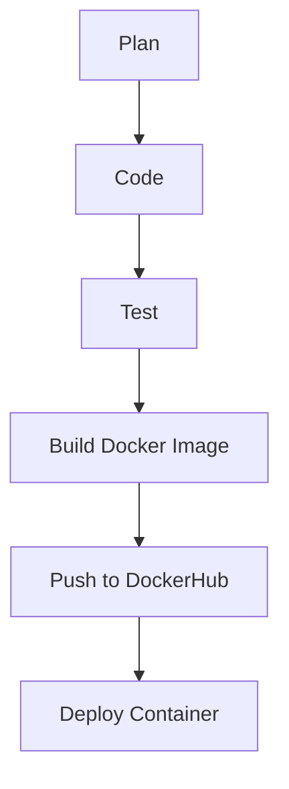

# 🚀 Jenkins CI/CD Pipeline for Python Flask App

This project demonstrates a complete CI/CD pipeline using **Jenkins (Master-Slave architecture)** to build, test, Dockerize, and deploy a simple **Python Flask application**.

## 📌 Features

- ✅ Python Flask application with unit testing
- ✅ Jenkins Master-Slave setup
- ✅ Declarative Jenkins Pipeline (`Jenkinsfile`)
- ✅ Docker image build and push to DockerHub
- ✅ Automatic container deployment post-push
- ✅ GitHub integration for Source Code Management

---

## 🧠 Pipeline Flow



---

## 🏗️ Project Structure

```
jenkins-python-app/
├── Dockerfile          # Builds the Docker image
├── Jenkinsfile         # Jenkins pipeline definition
├── app.py              # Flask application
├── test_app.py         # Unit tests for Flask app
├── requirements.txt    # Python dependencies
```

---

## ⚙️ Jenkins Pipeline Stages

### 1. **Clone Repository**
Clones the source code from GitHub to the Jenkins agent.

### 2. **Install Dependencies**
Sets up a Python virtual environment and installs dependencies.

### 3. **Run Tests**
Runs unit tests (`test_app.py`) to validate application logic.

### 4. **Build Docker Image**
Builds a Docker image with the Flask app using the provided `Dockerfile`.

### 5. **Push to DockerHub**
Pushes the Docker image to DockerHub using secure Jenkins credentials.

### 6. **Deploy Container**
Stops any running container and deploys a new one exposing it on port `5003`.

---

## 🐳 Dockerfile Overview

```dockerfile
FROM python:3.11-slim
WORKDIR /app
COPY . .
RUN pip install --upgrade pip && pip install -r requirements.txt
EXPOSE 5002
CMD ["python", "app.py"]
```

---

## 🧪 Sample Flask App

```python
@app.route('/')
def home():
    return "Hello from Jenkins + Python!"

@app.route('/status')
def status():
    return {"status": "ok"}
```

---

## 🧪 Sample Unit Test (`test_app.py`)

```python
def test_home(self):
    response = self.app.get('/')
    self.assertEqual(response.status_code, 200)

def test_status(self):
    response = self.app.get('/status')
    self.assertEqual(response.json, {"status": "ok"})
```

---

## 🔐 Jenkins Credentials

To push images securely, create Jenkins credentials:
- **ID:** `dockerhub-creds`
- **Username/Password:** Your DockerHub credentials

---

## 📦 DockerHub Repository

> Make sure to update the image name in the `Jenkinsfile`:
```groovy
IMAGE_NAME = 'your_dockerhub_username/flaskapp'
```

---

## ✅ Final Result

Once deployed, the Flask app is accessible at:

```
http://<jenkins-agent-ip>:5003/
```

Expected Output:
- `/` → `Hello from Jenkins + Python!`
- `/status` → `{ "status": "ok" }`
